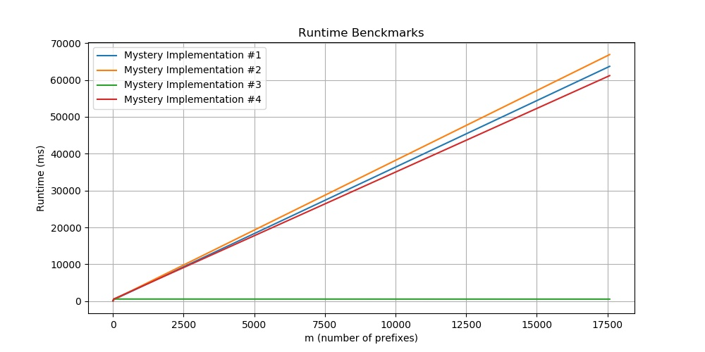

# Collaboration policy
This assignment may be completed in pairs using the pair-programming style of developing code described in previous assignments.

# Introduction

Please read the entire writeup before beginning the PA. In particular, take a look at part 3a to understand your requirements for a full score before attempting to implement a solution. You are graded on the running time efficiency of your solution. 

In this assignment, you will 
* Use a container data structure from the C++ Standard Template Library (STL) where possible and/or write your own data structure to store and query data.
* Analyze the time and space complexity of your algorithms.

# Goal of this assignment

* Use data structures from the C++ STL (STL) to solve a problem on a large, real-world dataset efficiently.
* Analyze the complexity of your algorithms using Big-O notation
* Explore the tradeoffs between time and space complexity.
* Organize your project's code independently (not just filling in a template).

*Note: The goals above are very important in the industry and interviews!*

# Getting Started

## Starter code

### GitHub repository

Refer to lab01 for instructions on how to set up a GitHub repository and 
pull the starter code for this lab.
Obtain the starter code from this repo: <https://github.com/ucsb-cs24-w24/STARTER-lab06>

### Contents
* `main.cpp`: driver code to read in movies from input files
* `movies.h` and `movies.cpp`: empty files
* `utilities.h` and `utilities.cpp`: empty files
* `Makefile`: this file generates the executable `runMovies`, and please do not revise it
* `input_20_ordered.csv`
* `input_20_random.csv`
* `input_100_ordered.csv`
* `input_100_random.csv`
* `input_1000_ordered.csv`
* `input_1000_random.csv` 
* `input_76920_ordered.csv`
* `input_76920_random.csv`
* `prefix_small.txt`
* `prefix_medium.txt`
* `prefix_large.txt`

You are given eight datasets in CSV files. Each CSV file:
* has either 20, 100, 1000, 76920 entries
* is either ordered in alphabetical order of movie name or ordered randomly

**Example of alphabetical order**
Below is a list of movie names  and their ratings, ordered alphabetically by movie name
```
ace ventura: when nature calls,6.1
balto,7.1
casino,7.8
cutthroat island,5.7
dracula: dead and loving it,5.7
father of the bride part ii,5.7
four rooms,6.5
goldeneye,6.6
grumpier old men,6.5
heat,7.7
jumanji,6.9
money train,5.4
nixon,7.1
sabrina,6.2
sense and sensibility,7.2
sudden death,5.5
the american president,6.5
tom and huck,5.4
toy story,7.7
waiting to exhale,6.1
```

**Example of random order**
```
toy story,7.7
jumanji,6.9
grumpier old men,6.5
waiting to exhale,6.1
father of the bride part ii,5.7
heat,7.7
sabrina,6.2
tom and huck,5.4
sudden death,5.5
goldeneye,6.6
the american president,6.5
dracula: dead and loving it,5.7
balto,7.1
nixon,7.1
cutthroat island,5.7
casino,7.8
sense and sensibility,7.2
four rooms,6.5
ace ventura: when nature calls,6.1
money train,5.4
```
 
## Files to complete
* `movies.cpp, movies.h`: these files should contain any abstractions that you need to define. 
	* We strongly discourage implementing any data structure available in the C++ STL from scratch. However, you are encouraged to think creatively about improving the running time efficiency of your solution and implement your own data structure if those provided in the STL are insufficient to meet your needs.
* `main.cpp`: this file should read in the movies from input files and produce the expected output.
* (Optional) `utilities.h` and `utilities.cpp`: you can place other helper functions, structs, and classes in these files.

## Problem statement
This assignment has three parts. You should **separate your algorithm for part 1 from your algorithm for part 2** because in part 3, you need to analyze the running time complexity of your solution to **part 2 only**.
* In part 1, your task is to print all movie names and ratings (from the CSV file) in alphabetical order of movie name.
* In part 2, you are given `m` prefixes of movie names. Your task is to find the movies whose names start with each prefix and find the highest-rated movie for each prefix. 
* In part 3, you will analyze the time and space complexity of your solution for part 2.

## Command-line arguments
```
./runMovies movieFilename prefixFilename
```

* `movieFilename` represents the input file containing movies and ratings (as described before).
* `prefixFilename` is an optional parameter which is the name of a .txt file that contains a list of prefixes, see `prefix_medium.txt` as an example. 
	* There may be up to `m` such prefixes in the file.
    * Prefixes may include whitespace, see `prefix_medium.txt` for examples. Each line in the file corresponds to exactly one prefix.


# Part 1: Print all movie names and ratings
Your program should print out all the movies in **alphabetical order of movie name**. You may use **only one data structure** of your choice to store the data from the CSV file. When testing this part, do not include the prefix file as a command-line argument!

**Example with no prefixes**
```
./runMovies input_20_random.csv 
```
This should produce the output
```
ace ventura: when nature calls, 6.1
balto, 7.1
casino, 7.8
cutthroat island, 5.7
dracula: dead and loving it, 5.7
father of the bride part ii, 5.7
four rooms, 6.5
goldeneye, 6.6
grumpier old men, 6.5
heat, 7.7
jumanji, 6.9
money train, 5.4
nixon, 7.1
sabrina, 6.2
sense and sensibility, 7.2
sudden death, 5.5
the american president, 6.5
tom and huck, 5.4
toy story, 7.7
waiting to exhale, 6.1
```

## Part 2: Find movies based on prefixes
In Part 2, the goal is to search for movies based on their prefixes. This involves finding movies whose titles begin with a particular set of letters or words. The search results will be limited to movies that match the specified prefix criteria.

In this case, your program will take an extra command-line argument that specifies the name of a second file containing one or more prefixes.
Then for each prefix, your program should:
* Find the movies whose names start with that prefix.
* Find the highest-rated movie for that prefix.

You may use additional data structures from the C++ STL to help you solve this part of the assignment, or you may write your own structure.

### Part 2a: All movies starting with a prefix
First, for each prefix, your program should print out all the movies whose names start with that prefix in **decreasing order of rating**. If multiple movies have the same rating, print them in alphabetical order of movie name. For example, print `the american president, 6.5` before `the confessional, 6.5`. If no movie names start with that prefix, then print 
```
No movies found with prefix <prefix_value>
```

### Part 2b: Highest-rated movie for a prefix
Second, for each prefix, your program should print the **highest rated** movie whose name starts with that prefix. If there is a tie for the highest-rated movie, then use the movie whose name comes first in alphabetical order.

### Examples
**Example with three prefixes and multiple movies with the same rating**
```
./runMovies input_100_random.csv prefix_small.txt
```
This should produce the following output:
```
toy story, 7.7
to die for, 6.7
tom and huck, 5.4

the usual suspects, 8.1
the city of lost children, 7.6
the postman, 7.6
the white balloon, 7.5
the journey of august king, 6.7
things to do in denver when you're dead, 6.7
the american president, 6.5
the confessional, 6.5
the crossing guard, 6.1
the indian in the cupboard, 5.9
the juror, 5.5
the big green, 5.2

wings of courage, 6.8
white squall, 6.3
waiting to exhale, 6.1
when night is falling, 5.9

Best movie with prefix to is: toy story with rating 7.7
Best movie with prefix th is: the usual suspects with rating 8.1
Best movie with prefix w is: wings of courage with rating 6.8
```

**Another example of multiple movies with the same rating**
*let prefix.txt be a file that contains the prefix "be"*
```
./runMovies input_1000_random.csv prefix.txt
```
should produce the output:
```
before sunrise, 7.7
before the rain, 7.7
beauty and the beast, 7.5
belle de jour, 7.3
beautiful girls, 6.6
beyond rangoon, 6.4
beat the devil, 6.2
before and after, 5.8
beverly hills cop iii, 5.5
bed of roses, 5.1
being human, 5.0
beyond bedlam, 4.0

Best movie with prefix be is: before sunrise with rating 7.7
```

**Example with no movies for a given prefix**
*Let prefix.txt be a file that contains the prefixes: "t" and "xyz"
```
./runMovies input_100_random.csv prefix.txt
```
should produce the output
```
the usual suspects, 8.1
toy story, 7.7
the city of lost children, 7.6
the postman, 7.6
the white balloon, 7.5
twelve monkeys, 7.4
the journey of august king, 6.7
things to do in denver when you're dead, 6.7
to die for, 6.7
the american president, 6.5
the confessional, 6.5
the crossing guard, 6.1
the indian in the cupboard, 5.9
the juror, 5.5
tom and huck, 5.4
two bits, 5.4
the big green, 5.2
two if by sea, 4.5

No movies found with prefix xyz

Best movie with prefix t is: the usual suspects with rating 8.1
```

## Part 3: Analyze the time and space complexity of your algorithm from part 2
Assume that
* there are `n` movies in the dataset.
* there are `m` prefixes specified in a given run of your program.
* at most `k` movies begin with each prefix.
* `l` is the maximum number of characters in a moview name


### Part 3a: Analyze time complexity
Analyze the worst-case Big-O time complexity of your algorithm from part 2 of the assignment. You may assume that 
* all `n` movies are already stored in your data structure.
* all `m` prefixes are already stored in an array.

First, provide the time complexity analysis as a **commented block** right after your `main()` function in `main.cpp`. Note that 

* select the parameters that could affect the running time complexity of your algorithm among `n`, `m`, `k`, and `l`.
* express your final Big-O running time in terms of the relevant parameters. 
* your final answer will depend on your data structure and algorithm choices. 

Second, report on **specific running times achieved by your solution** on *each* random input file: `input_20_random.csv`, `input_100_random.csv`, `input_1000_random.csv`, and `input_76920_random.csv`, using `prefix_large.txt` as the second parameter. 

. Write down the number of milliseconds it takes for your solution to run on each input. Only report on the randomized datasets. 

* Be sure to check that the trend in your proposed time complexity from (1) somewhat matches with trends in your runtimes from (2)

You will be graded for the efficiency of your algorithms but also the clarity and correctness of your analysis. 

Here are runtime plots of three different types of solutions. These runtimes were gathered on the csil machines on the input files `input_76920_random.csv`, recording the running time to compute the result for the first `m` prefixes in `prefix_large.txt` to get each data point in the plot. If you want to get a proper runtime comparison, please run your code on csil. 
* **Full credit will be given to solutions with an efficiency similar to `Mystery Implementation #4`**

* The students who achieve the top 5 runtimes will receive **extra credit**




### Part 3b: Analyze space complexity
Analyze the worst case Big-O space complexity of your algorithm from part 2 of the assignment. You may assume that 
* all `n` movies are already stored in your data structure.
* all `m` prefixes are already stored in an array.

You must provide the space complexity analysis as a **commented block** under your time complexity analysis. Note that 
* select the parameters that could affect the space complexity of your algorithm among `n`, `m`, `k`, and `l`.
* express your final Big-O space complexity in terms of the relevant parameters. 
* your final answer will depend on your data structure and algorithm choices. 

You will be graded for the efficiency of your algorithms but also the clarity and correctness of your analysis. However, we are not giving you a target Big-O space complexity. 

### Part 3c: Explore tradeoffs between time/space complexity
Briefly state how you designed your algorithm from part 2 of the assignment for the task at hand. More specifically, answer this question:
* Did you design your algorithm for a low time complexity, a low space complexity, or both? What were your target complexities?

Based on your answer to the question above, answer one of the following:
1. If you designed your algorithm for a low time complexity,
    * Were you able to achieve a low space complexity as well?
    * Why or why not?
2. If you designed your algorithm for a low space complexity,
    * Were you able to achieve a low time complexity as well?
    * Why or why not?
3. If you designed your algorithm for both,
    * Were you able to achieve both?
    * Why or why not?
    * Which was harder to achieve: low time complexity or low space complexity?

You must provide these answers as a **commented block** under your space complexity analysis.

You will be graded for the clarity and thoughtfulness of your analysis.

## Requirements
For this programming assignment, you will have a lot of flexibility on your implementation (which just means we won't be providing a code framework for you to fill in). However, there are a few requirements that you need to keep in mind as you think about your solution:

* You must make appropriate use of data structures from the STL where possible, and implement your own only when needed. For example, if you need a bst, just use the implementation provided in the STL instead of implementing it from scratch. 
* First, try to come up with a correct implementation, then think of how to optimize it.
* Your code should be readable
* Your classes should define clear interfaces and hide implementation details as much as possible. 
* You must include your space and time complexity analyses (part 3) in `main.cpp`, as a commented block under the `main()` function
